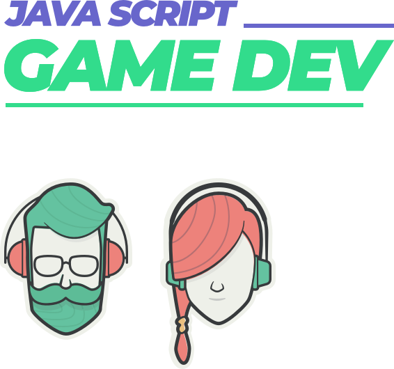
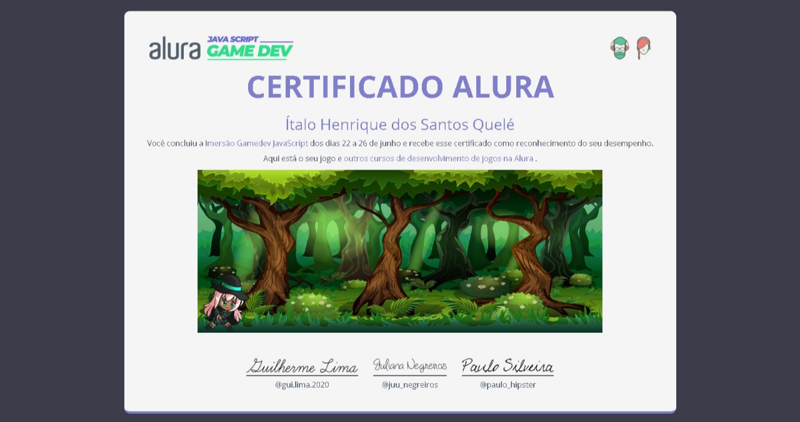

<h1 align="center">
    
    <br>
</h1>

<h2 align="center">
  🚀🕹️ Imersão Game Dev Alura 🕹️🚀
</h2>

<p align="center">
   
<p align="center">
  
</p>

## 💻 Projeto

As aventuras de Hipsta é um projeto game com objetivo de levar a diversão para os gamers e também levar a nossa bruxinha ao mais longe possível de seus inimigos

## 👨🏼‍💻 Desenvolvedor 

- [Ítalo Henrique](https://www.linkedin.com/in/italo-tech/)

## :rocket: Tecnologias

Esse projeto foi desenvolvido com as seguintes tecnologias:

- [Javascript p5](https://editor.p5js.org/)

<p align="center">
  <h2 align="center"> Jogue em seu computador e divirta-se!</h2>
  <a href="https://editor.p5js.org/Italo-Tech/full/yJCRaodkY">
    <p align="center">Clique aqui para acessar ao jogo e repasse para os amigos rss</p>
	</a>
</p>


## Para visualizar o meu certificado:

```
$ Abra o index.html em seu computador
## Por questões de segurança, retirei as assinaturas!
```

<h4 align="center">
    Faça conexão comigo: <a href="www.linkedin.com/in/italo-tech" target="_blank">LinkedIn</a>
</h4>

<h4 align="center">
  <h4 align="center">Espero que tenha gostado, e se sim, deixe aquela Star. Obrigada!</h4>
</h4>
